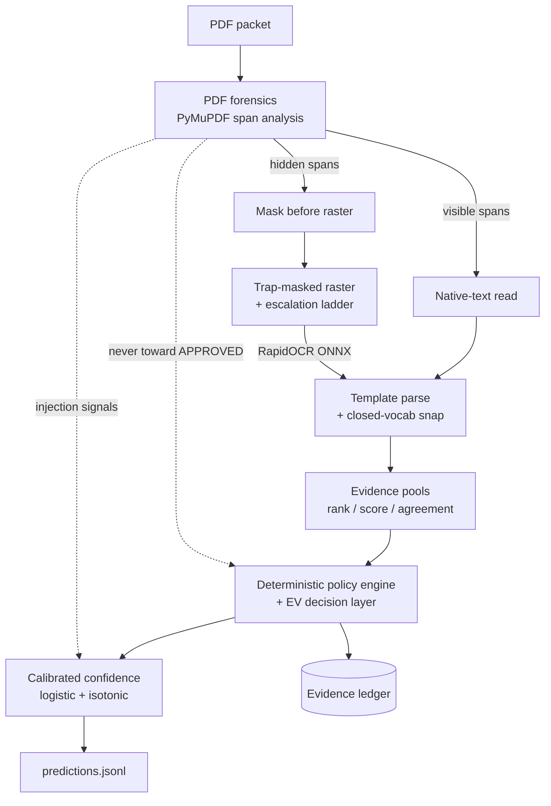

# MIB Intergalactic Intake — Adjudication Engine

An offline, CPU-only pipeline that reads adversarial PDF case packets, extracts a
structured applicant record, and recommends `APPROVED` / `DENIED` /
`NEEDS_REVIEW` — with a calibrated confidence and a per-case evidence ledger
behind every decision.

This is built as an **auditable adjudication system, not an OCR script**. Every
decision is reconstructible from the evidence that produced it, approvals are
gated on positively-read and cross-corroborated evidence, and hidden/injected
text is treated as a distrust signal that can only ever push *away* from
approval — never as evidence.

Reviewers: `docs/REVIEWER_GUIDE.md` maps every claim in `MEMO.md` to the
fastest way to verify it.

## One-command reproduction

The commands below assume the challenge repository's `data/` directory is
available in this checkout (for example `ln -s <challenge-repo>/data data`);
see `MIB_CHALLENGE_DIR` under Layout.

```bash
# Build and label the exact clean revision (no network needed at run time)
PRODUCER_SHA="$(git rev-parse HEAD)"
docker build --label "org.opencontainers.image.revision=$PRODUCER_SHA" \
  -t "mib-intake:$PRODUCER_SHA" .

# Run under the exact scoring contract: no network, 4 CPU, 8 GiB, read-only root
docker run --rm --network none --cpus 4 --memory 8g \
  --read-only --tmpfs /tmp \
  -v "$PWD/data/validation:/in:ro" -v "$PWD/out:/out" \
  "mib-intake:$PRODUCER_SHA" /in /out/predictions.jsonl
```

Add `--ledger /out/ledger.jsonl` after the output path (or set `MIB_LEDGER`) to
emit the per-case evidence audit trail alongside the predictions.

Optional, audit-grade identity-bound rerun — a bound candidate evaluation must
also pass all three identity arguments (`evaluation/image-inspect.json` and
`evaluation/runtime-manifest.json` are captured from the actual image first,
e.g. `docker image inspect "$IMAGE_ID" > evaluation/image-inspect.json`):

```bash
# First create the supervised pre-run identity from the clean checkout, saved
# image inspection, actual-image runtime manifest, config, and ordered inputs.
IMAGE_ID="$(docker image inspect --format '{{.Id}}' \
  "mib-intake:$PRODUCER_SHA")"
python tools/prepare_native_run_identity.py \
  --repo . --producer-sha "$PRODUCER_SHA" --image-id "$IMAGE_ID" \
  --image-inspect evaluation/image-inspect.json \
  --runtime-manifest evaluation/runtime-manifest.json \
  --effective-config-json '{"MIB_NATIVE_SCAN_OCR":"1"}' \
  --input-dir data/train --split dev --partition dev-md5 \
  --output evaluation/run-identity-dev.json

# The run directory must not exist. The producer creates it exclusively.
docker run --rm --network none --cpus 4 --memory 8g \
  --read-only --tmpfs /tmp \
  -e MIB_NATIVE_SCAN_OCR=1 \
  -v "$PWD/data/train:/in:ro" -v "$PWD/evaluation:/out" \
  "$IMAGE_ID" /in /out/run-dev/predictions.jsonl \
  --ledger /out/run-dev/evidence.jsonl \
  --run-receipt /out/run-dev/run-receipt.json \
  --run-identity /out/run-identity-dev.json \
  --run-split dev
```

Before workers start, the producer validates the predeclared
producer/image/runtime identity against its live configuration, split, nonce,
and ordered input bytes, then exclusively creates the run directory. Workers
consume the resolved paths hashed at preflight, and the producer re-hashes all
inputs at completion. It publishes no receipt until the prediction and evidence
files are closed, durable, and the only two files in that directory. The
completion receipt is atomically published without clobbering and records their
exact filenames, sizes, and SHA-256 hashes; its later binding hash supplies
tamper evidence rather than filesystem immutability.
`tools/native_artifact_binding.py` re-hashes those artifacts and pins the whole
verified binding for audit. The saved image inspection and runtime manifest
remain supplied evidence; capture them from the actual image because these
Python tools do not themselves query Docker or hash `/app`.

Before any OCR run, `tools/native_selector_census.py` can inspect the same
identity-bound partition without invoking the recognizer. It binds the clean
producer commit, the executing selector/census source bytes, the effective
configuration, and a byte snapshot of every selected PDF; every successfully
inspected page receives one stable selector outcome and document-open failures
remain explicit invalid records.

## Architecture



**Five stages** — `MEMO.md` documents the same pipeline as six layers,
splitting the two-ledger native/composited fusion (folded into stage 1 here)
into its own layer:

1. **PDF forensics + two physical views** — every text span is classified
   visible/hidden by render mode, opacity, color, size, and page-crop position.
   A guarded full-page scan selector can decode the image directly for OCR, so
   a hostile PDF text bbox can never erase independent scan ink. A parallel
   composited pass uses its own historical fast/HQ escalation decision and
   retains the unconditional P0-B rank-1 note authority. Composited/P0-B
   ordinary evidence that could block approval remains a review-only guard: it
   can never populate benign output fields, but native evidence loss cannot
   open a new approval. A native note may add
   only exactly case-bound signed findings or corrections; its ordinary note
   fields never cross that authority boundary, the composited payload is never
   replaced, and conflicting views force review. Native/composited fusion is
   the production default after passing its sealed holdout gate; setting
   `MIB_NATIVE_SCAN_OCR=0` remains an explicit control-arm opt-out. PDF text,
   clipping, masks, optional content, and graphics state remain a separate
   distrust view. Ambiguous pages use a composited render with hidden spans
   masked before enhancement.
2. **Native-scan OCR with a budget-aware escalation ladder** — RapidOCR
   (PP-OCRv5 mobile ONNX) at a low-resolution fast path; packets
   still missing deny-relevant fields earn a full-resolution second pass, since
   the 6 s/PDF budget is an average. Native-text pages bypass OCR. On the sealed
   201-packet holdout, the full fusion path improved the score from 125.87 to
   126.09 with zero false approvals and no execution errors. The later
   human-review hardening pass raised the committed tree's holdout score to
   126.46 while preserving zero false approvals.
3. **Template parsing with closed-vocabulary snapping** — every field but
   dates/IDs snaps to a small legal set; snap margin and cross-page agreement
   become confidence features. Decoy pages naming a different case ID are
   ignored; explicit damage markers (`[DATE WASHED OUT]`) are parsed as proof
   of absence.
4. **Deterministic policy engine** — the field-manual rules plus rules inferred
   from labeled examples (Wolf-1061c soft embargo, extra revoked sponsors, an
   order-statistic staleness epoch that adapts to a regenerated test set).
   Reproduces 97.3% of training adjudications from true fields with zero
   APPROVED/DENIED confusions.
5. **Decision theory + calibrated confidence** — decisions maximize expected
   value under the scoring matrix (approve only when P(A) > 1.5·P(D) and it
   beats the review hedge; never omit a case). Confidence is a per-case logistic
   calibrator with isotonic correction, fit out-of-fold.

## Robustness

- **Per-PDF watchdog** (`scripts/predict.py`): a three-layer defense against a
  single pathological PDF eating the 30,000 s batch cap — an in-worker SIGALRM
  per-case deadline, plus a parent heartbeat watchdog that kills and respawns a
  worker hung below the Python signal layer, plus a planned fresh-process
  recycle every 48 completed packets to stay well clear of the native-library
  lifetime cliff observed in the first 5,000-packet control run. Completed rows
  are flushed and `fsync`'d before every recycle, and the parent resumes only
  the unfinished tail. Every case still gets one well-formed row. Verified with
  injected hangs and byte-identity recycle tests in `tests/test_watchdog.py`.
- **Batch-deadline governor** (`scripts/predict.py`, `scripts/run_shard.py`):
  the layers above protect the batch from *one* pathological packet; the
  governor protects it from *slow evaluation hardware*, where every case is
  fine but the sum breaches the 30,000 s cap and the container is hard-killed
  with the run unrecoverable. The supervisor projects the finish time from
  recent completion pace and publishes a degradation level that workers read
  per case, shedding the least valuable OCR work from not-yet-started cases
  first — native-scan page budgets (measured cost on the full training set:
  0.024 points), then the native second view (0.049 points), both with zero
  decision changes — and recovering as the projection improves. Level 0 is
  byte-identical to an ungoverned run; on hardware inside the budget it never
  engages, and the shipped 5,000-case run logged zero engagements. Governed
  cases record their level in the evidence state (`governor_level`). Tests in
  `tests/test_governor.py`; disable with `MIB_GOVERNOR=0`.
- **Anti-oracle approval guard** (`MIB_ANTI_ORACLE_GUARD`, enabled in the
  shipped container by `run.sh`): the one deliberate exception to the
  trap-equals-clean-twin invariant below, and it runs in the safe direction
  only. A tentative APPROVED whose packet carries a hidden answer key that
  itself claims APPROVED — with no adjudicator-note authority behind the
  approval — demotes to NEEDS_REVIEW. The planted key's adjudication is wrong
  in all 216 labeled occurrences, so agreement with it is a trap signature
  rather than corroboration. Hidden content is still never evidence: the guard
  can only move a decision *away* from approval, and it fires on zero of the
  1,000 labeled training cases.
- **Self-authored red-team corpus** (`tests/redteam_corpus/`, built by
  `tools/redteam/build_corpus.py`): every injection vector the spec names but
  the public data omits — QR/barcode instructions, under-image text, hidden OCG
  layers, render-mode-3, opacity-0, microtext, visible answer-key decoys,
  sample-denial watermarks, hidden-only field values. `tests/test_redteam.py`
  proves each trap changes nothing versus its clean twin and no hidden token
  reaches output.
- **Perturbation harness** (`tools/perturb.py`): re-renders a dev subsample with
  degradations the training set lacks (180° pages, heavy wash, DPI resample,
  smudges relocated onto labels) and reports score stability.

## Layout

```
mib/            runtime package (forensics, ocr, parse, rules, pipeline)
models/         12 MB: OCR recognizer (7.9 MB ONNX), pixel bank, the
                default-off character transducer, and small JSON artifacts
                (name lexicon, path priors, calibrator, reason buckets)
scripts/        predict.py (entrypoint) + run_shard.py; dev-time fitters
tools/          dev-time harnesses (census, perturbation, review/red-team builders)
tests/          golden rule tests, decision table, watchdog, red-team corpus
run.sh          container entrypoint (execs scripts/predict.py)
Dockerfile      offline CPU image (no torch, no LLM)
MEMO.md         the technical memo (approach, negative results, failure modes)
SUBMISSION.md   contract measurements + predictions provenance
NOTICE.md       third-party licenses + provenance of every models/ artifact
docs/           REVIEWER_GUIDE.md (verify the claims in 15 minutes) + opportunity register
experiments/    CFA-MIB-000865 irreducibility forensic
```

Set `MIB_CHALLENGE_DIR` to your checkout of the public challenge repository if
it is not a sibling directory of this one; dev-time tooling and the data-backed
tests resolve the training PDFs and labels through it.

## Testing

**Recommended — run inside the image you already built.** No local Python setup,
and the dependency versions are guaranteed to match the scored container:

```bash
docker build -t mib-submission .
docker run --rm --entrypoint bash -v "$PWD:/src" -w /src mib-submission -c \
  "pip install -q pytest && python -m pytest tests/ -q"
# 990 passed, 110 skipped, 0 failed
```

`pytest` is not in the runtime image, so this command needs network access while
the scored run does not. Everything that cannot run in a bare container skips
rather than fails: 44 provenance tests need `git` (absent from
`python:3.11-slim`) and the rest are data-backed. Add `git` and a challenge
checkout to run them all:

```bash
docker run --rm --entrypoint bash \
  -v "$PWD:/src" -v /path/to/mib-doc-challenge:/challenge -w /src \
  -e MIB_CHALLENGE_DIR=/challenge mib-submission -c \
  "apt-get update -qq && apt-get install -y -qq git && pip install -q pytest && \
   python -m pytest tests/ -q"
# 1,100 collected: 1,049 passed, 51 skipped, 0 failed
```

The suite covers golden tests for every mined policy rule, the EV decision
table, vocab snapping and parser guards, span classification, the calibrator
round-trip, injected-hang recovery, the governor ladder, and the full red-team
corpus.

**Running it locally instead?** Install the pinned set on **Python 3.11–3.13**:

```bash
python3.11 -m venv .venv && .venv/bin/pip install -r requirements.txt pytest
.venv/bin/python -m pytest tests/ -q
```

`requirements.txt` mirrors the `Dockerfile`'s pins exactly, and the pins are
load-bearing rather than incidental — RapidOCR's preprocessing and the
recognizer's numerics are part of the measured result, so floating them changes
OCR output and invalidates the reported scores. Do not install unpinned:
`rapidocr-onnxruntime` after 1.4.4 changed the `RapidOCR(...)`
detector-parameter API, so about a dozen OCR-path tests fail during engine
construction before any assertion runs. Python 3.14 cannot be used at all —
`onnxruntime==1.20.1` publishes no wheel for it.

`tools/build_review_kit.py` rebuilds the evidence-aware HTML review kit from a
specific truth/prediction/ledger/state bundle. It refuses to overwrite an
existing kit, records hashes for every input artifact, validates all local
links, and keeps hidden PDF content quarantined from reviewer hints.

## Compliance

CPU-only, offline, deterministic seeds. No LLM, VLM, or instruction-following
component of any size runs at inference time — the system contains nothing that
can be prompt-injected.

Measured inside the scoring container under the exact contract flags
(`--network none --cpus 4 --memory 8g --pids-limit 512 --read-only
--tmpfs /tmp:size=2g`), on the image built from a clean clone of this
repository at the submission commit:

| Limit | Measured | Margin |
| --- | --- | --- |
| 6 s/PDF average | 3.43 s/PDF | 1.75× |
| 30,000 s for 5,000 PDFs | ~17,100 s (4.8 h) | 1.75× |
| Image ≤ 4 GiB uncompressed | 0.27 GiB | 14.8× |
| Model artifacts ≤ 1 GiB total, ≤ 250 MiB each | 12 MB total, 7.9 MB largest | 85× / 32× |
| Memory 8 GiB | 3.3 GiB peak RSS | 2.4× |
| Predictions ≤ 25 MiB | 1.6 MB | 15× |

Verified on both architectures: the `Dockerfile` builds clean for
**linux/amd64** as well as linux/arm64 (0.295 GiB and 0.267 GiB respectively —
every pinned wheel resolves on both), and packets processed by the amd64 image
produce rows **byte-identical** to the arm64-produced submitted rows. The
timings below are arm64.

The per-PDF figure is wall-clock across the whole batch at 4 workers, which
saturate the 4-vCPU quota (measured 400% CPU). The production 5,000-packet
validation run — run natively at the same commit — completed in 4 h 04 m with
zero per-case timeouts, zero retries, and zero governor engagements; its
slowest packet took 57.0 s against the 120 s per-case deadline. These are
Apple-silicon numbers and the evaluation hardware's per-core speed is unknown,
which is what the batch-deadline governor above exists to absorb. The margin is
not fragile: an earlier in-container measurement taken while the host was busy
with concurrent work gave 4.19 s/PDF, still projecting to ~20,900 s (5.8 h),
inside the cap with 1.43× to spare.
