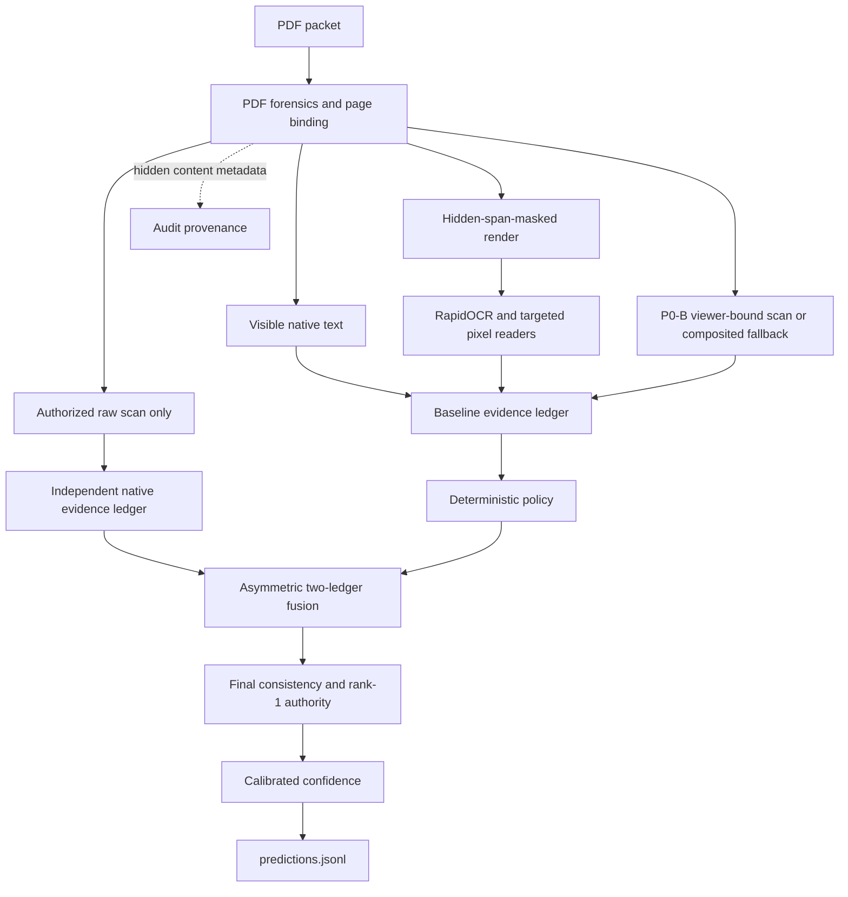

# MIB Intergalactic Intake — Adjudication Engine

An offline, CPU-only pipeline that reads adversarial PDF case packets, extracts
the required applicant record, and emits `APPROVED`, `DENIED`, or
`NEEDS_REVIEW` with calibrated confidence and an optional evidence ledger.

The system is designed around source authority rather than OCR alone. It keeps
visible and hidden PDF content separate, can reason over two physical views when
a raw scan is viewer-authorized, binds evidence to the active case, and makes
decisions through a deterministic policy. Expected-value analysis is used
offline to assess proposed
policy changes; it is not a production decision layer. Confidence is computed
after adjudication.

[`MEMO.md`](MEMO.md) explains the approach and trade-offs.
[`docs/REVIEWER_GUIDE.md`](docs/REVIEWER_GUIDE.md) maps the public claims to
tracked code, tests, and artifacts.

## Reproduce the submission contract

Set `CHALLENGE_DIR` to an absolute checkout of the official challenge repository
and run from this repository. Docker may need network access while building the
image; inference runs with networking disabled.

```bash
CHALLENGE_DIR=/absolute/path/to/mib-doc-challenge
OUTPUT_DIR=/tmp/mib-submission-output
PRODUCER_SHA=4313d28b34abc4cef4c89586060f4d3d34848c88
mkdir -p "$OUTPUT_DIR"
git checkout --detach "$PRODUCER_SHA"

docker build --platform linux/amd64 \
  --label "org.opencontainers.image.revision=$PRODUCER_SHA" \
  -t "mib-intake:$PRODUCER_SHA" .

docker run --rm --platform linux/amd64 \
  --network none --cpus 4 --memory 8g --pids-limit 512 \
  --read-only --security-opt no-new-privileges \
  --tmpfs /tmp:rw,nosuid,nodev,size=2g \
  --mount type=bind,src="$CHALLENGE_DIR/data/validation",dst=/input,readonly \
  --mount type=bind,src="$OUTPUT_DIR",dst=/output \
  "mib-intake:$PRODUCER_SHA" /input /output/predictions.jsonl

python3 "$CHALLENGE_DIR/scripts/validate_submission.py" \
  --submission "$OUTPUT_DIR/predictions.jsonl" \
  --manifest "$CHALLENGE_DIR/data/validation_manifest.csv" \
  --require-complete
```

The required interface accepts two positional arguments,
`<input_pdf_dir> <output_predictions_path>`. To produce an evidence ledger
during an audit run, append `--ledger /output/evidence.jsonl` after the output
path.

The named commit is the prediction producer. Later public commits may update
tests, audit tooling, and documentation; files copied into the scoring image are
unchanged unless a newer producer is explicitly named.

## Architecture



### 1. PDF forensics and evidence isolation

Text spans are classified by visibility using render mode, opacity, colour,
size, crop position, font context, clipping, transparency, geometry, and paint
order. Untrusted regions are overwritten
immediately after the base render and before enhancement or OCR so invisible
PDF text cannot reappear in the OCR image. The runtime does not parse hidden
verdict direction. Generic hidden-content presence and field-category indicators
may remain as audit, conservative distrust, or calibration signals; hidden
values never populate fields or support `APPROVED` or `DENIED`.

There is no LLM, VLM, or instruction-following component at inference time, and
arbitrary document prose is not treated as an executable command. Hostile-document
risk still exists: visible decoys, hidden text, ambiguous page identity, and forged-looking
surfaces can poison evidence. The system addresses that risk with source
ranking, physical-view separation, case binding, explicit distrust guards, and
conservative review outcomes.

### 2. OCR and targeted readers

RapidOCR uses an ONNX mobile recognizer. Ordinary native-text pages may bypass
full OCR; a native-text rank-1 authority surface deliberately incurs a 250-DPI
raster/OCR corroboration. Scanned pages start on a fast path and may escalate
when deny-relevant evidence remains missing. Parsed values are normalized and,
where appropriate, snapped to closed vocabularies. Independent source agreement
and snap margin remain attached to each candidate.

Template-specific readers are direction-asymmetric. A flag reader can emit only
disqualifying flags, and an embargo reader only embargo worlds, so they cannot
create approval evidence. Approval-adjacent reads are stricter: for example,
“paid” requires positive evidence that the `un` prefix region is clean.
Manual cancellation likewise requires a viewer-trusted word and visible vector
stroke. Negated authority text is rejected before it can become evidence.
Accepted raw authority spellings are retained beside their canonical values so
an OCR alias cannot survive a matching strike merely because normalization
changed its spelling. Struck rank-1 payloads are rebuilt with mutually
consistent values, evidence, and conflicts before binding. When adverse
cancellation remains ambiguous, the result may narrow to review but not
approval. This is conservative token/field provenance, not a claim of exact
occurrence or page attribution.

### 3. Two independent evidence ledgers

The baseline path reads composited pages after hidden-span masking. Its P0-B
pixel observer decodes an embedded scan only when exact resource identity,
geometry, crop/rotation, paint inventory, and compositing checks bind it to the
page a conforming viewer displays; otherwise it uses a fresh composited-page
render. That fallback remains baseline evidence. A separate native ledger is
created only for an authorized raw scan and otherwise abstains. The frozen
fusion selector may replace weak baseline fields with stronger legal native
values, but it cannot create an approval. Explicit native adverse evidence may
narrow a baseline review to a denial; all other unauthorized transitions
preserve the baseline decision.

### 4. Deterministic adjudication and confidence

[`mib/rules.py`](mib/rules.py) applies the field policy. Additional evidence
gates and rank-1 note handling live in [`mib/pipeline.py`](mib/pipeline.py), and
the two-ledger transition policy is in [`mib/two_ledger.py`](mib/two_ledger.py).
Production does not call `optimal_decision`; that function and its tests encode
the scoring matrix for offline analysis.

After fusion, ordinary approvals are checked against the exact fields that will
be emitted. A contradiction normally narrows the case to `NEEDS_REVIEW`. A
visible rank-1 adjudicator finding on an accepted note surface may override
lower-rank fields. When authority originates from native PDF text, a 250-DPI
composited raster/OCR reread must exactly corroborate every authority-bearing
value; otherwise authority is removed and ordinary fields are downgraded. Pages
confidently naming a foreign case are quarantined; native-only alternate
authority additionally requires an exact body Case ID. Conflicts remain
recorded, and emitted fields change only when explicit correction text is
present.

Once the final decision path is fixed, a logistic/isotonic calibrator and
reason-bucket shrinkage produce confidence. Confidence describes the chosen
result; it does not choose the result.

## Reliability controls

- **Per-case deadline:** `scripts/run_shard.py` applies a SIGALRM timeout and
  emits a conservative failed state rather than omitting the case.
- **Heartbeat watchdog:** `scripts/predict.py` detects a worker stuck below the
  Python signal layer and replaces it on the unfinished tail.
- **Active worker recycling:** each worker exits after 48 completed cases by
  default. The completed state is flushed and `fsync`ed before replacement.
- **Retry and completeness pass:** up to 128 failed-case candidates may receive
  one full-quality fresh-process retry, subject to a measured 3,600-second
  retry wall and the batch finalization reserve; any unresolved case still
  receives a validator-safe `NEEDS_REVIEW` row.
- **Batch governor:** the supervisor estimates completion time and can reduce
  work for not-yet-started cases in measured stages if the batch is trending
  past the limit. Level 0 is output-identical to the ungoverned path.
- **Hard finalization reserve:** the supervisor signals all workers before a
  shared bounded reap, preserves durable completed states, and atomically emits
  validator-safe `NEEDS_REVIEW` rows for anything still unresolved.

Governor level 0 is tested as output-equivalent to the ungoverned path. The
12-case red-team output repeated byte-identically across two native ARM64 runs
and one emulated AMD64 run. Full-batch byte identity is not claimed across
scheduling, governor, architecture, or timeout-boundary changes.

## Adversarial testing

[`tests/redteam_corpus/`](tests/redteam_corpus/) contains paired PDFs covering
white-on-white and off-crop text, zero opacity, invisible render mode, hidden
optional-content layers, under-image text, microtext, visible answer-key decoys,
sample-denial watermarks, hidden-only fields, and QR instructions. The tests
require trap packets to preserve the clean twin's extracted fields and
adjudication, except where the trap intentionally withholds visible evidence,
and verify that poison tokens do not enter emitted fields.

The suite also covers policy rules, parsing, confidence, native-view isolation,
viewer-bound spans, native rank-1 corroboration, watchdog recovery, batch
deadline finalization, recycling, retries, governor behavior, and final
consistency. See [`tests/test_visible_span_security.py`](tests/test_visible_span_security.py),
[`tests/test_native_text_rank1_corroboration.py`](tests/test_native_text_rank1_corroboration.py),
and [`tests/test_batch_deadline.py`](tests/test_batch_deadline.py).

```bash
# Host-side test environment (Python 3.11-3.13)
python3.11 -m venv .venv
.venv/bin/pip install -r requirements.txt pytest
MIB_CHALLENGE_DIR="$CHALLENGE_DIR" .venv/bin/python -m pytest tests/ -q
```

Some tests require the challenge data; provenance tests also require Git. The
test harness reports controlled skips when those external prerequisites are not
available rather than misreporting them as product failures.

With the full challenge checkout mounted, an executable 2-GiB test tmpfs, and
the pinned release image dependencies, the final producer reported **1,183
passed, 106 controlled skips, and zero failures**.

## Runtime measurements

The 5,000-case release measurement uses the official 4-vCPU, 8-GiB, no-network
contract on native ARM64. The linux/amd64 release image is separately built and
tested under emulation from the same public runtime source. The accepted release
identities are recorded together here:

| Constraint | Release measurement |
| --- | --- |
| Average runtime | `3.8372` s/PDF on native ARM64 |
| Completed 5,000-case runtime | `19,186.18` s |
| Runtime events | 82 fresh-process retries, all recovered (81 watchdog exits with missing primary state and one primary per-case timeout); zero terminal failures; governor level 0 throughout; no batch-deadline backfill |
| Memory | 8 GiB hard limit enforced by Docker |
| Local Docker image IDs | AMD64: 316,434,546 bytes, `sha256:f6447a9720c0ca52616d83f245ecb804d418b94bd503f8fe57fe551a3e36f95d`; ARM64: 286,493,358 bytes, `sha256:21515e59b31fecaed2eb9983527c0751079abc9c9d3c7711142214c523bdae3f` |
| Model artifacts | 28,750,436 bytes total; 10,857,958 bytes largest |
| Prediction file | `1,683,486` bytes; SHA-256 `4ff616d449d1931b461220b21b9c9ca2d1dba3bb82b6e3c021bf659b8f2822be` |
| Prediction-producing source | `4313d28b34abc4cef4c89586060f4d3d34848c88` |
| Source/runtime binding | Full native-ARM64 manifest binding passed |

The `linux/amd64` release image was built and tested under emulation on Apple
silicon; the reproduction command selects that platform explicitly. The pinned
base is a multi-architecture index, so the same Dockerfile can also be built
natively on Apple silicon. On an eight-case OCR-sensitive panel, adjudications
matched across architectures, while emitted fields were not row-identical on
any of the eight. Exactly two emulated AMD64 cases reached both the per-case
timeout and retry-failure path and emitted conservative fallback rows. The
ARM64 fee-reader panel was unchanged from the prior producer. No full AMD64
throughput or cross-platform row-identity claim is made.

## Repository map

```text
mib/            extraction, evidence, policy, fusion, and confidence runtime
models/         OCR and candidate-trained artifacts
scripts/        scored entrypoint and worker process
tests/          unit, integration, watchdog, and adversarial tests
tools/          development and audit utilities; not copied into the runtime image
run.sh          container entrypoint
Dockerfile      offline inference image
MEMO.md         1-2 page technical memo
SUBMISSION.md   submission contract and final identity fields
NOTICE.md       dependency licenses and model provenance
docs/           reviewer map and a dated research register
experiments/    the tracked MIB-000865 visible-evidence forensic
```

The dated performance register is a research log, not the proof record for the
final release. It references some private working receipts that are intentionally
not in this public repository. An absent receipt should be treated as unavailable,
not as public verification; the reviewer guide links only tracked evidence. The
release dependency and model inventory is recorded in the current
[`NOTICE.md`](NOTICE.md). The prediction-producing source identity is recorded
separately above.
