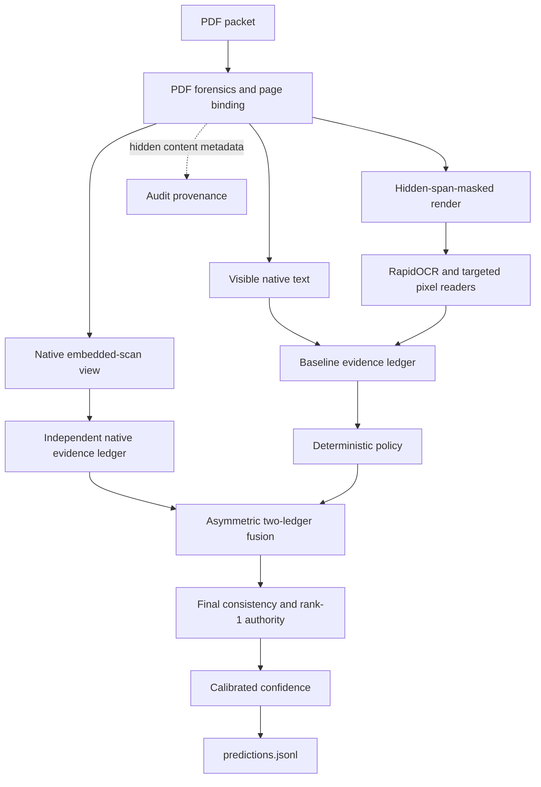

# MIB Intergalactic Intake — Adjudication Engine

An offline, CPU-only pipeline that reads adversarial PDF case packets, extracts
the required applicant record, and emits `APPROVED`, `DENIED`, or
`NEEDS_REVIEW` with calibrated confidence and an optional evidence ledger.

The system is designed around source authority rather than OCR alone. It keeps
visible and hidden PDF content separate, reasons over two physical views of
scanned pages, binds evidence to the active case, and makes decisions through a
deterministic policy. Expected-value analysis is used offline to assess proposed
policy changes; it is not a production decision layer. Confidence is computed
after adjudication.

[`MEMO.md`](MEMO.md) explains the approach and trade-offs.
[`docs/REVIEWER_GUIDE.md`](docs/REVIEWER_GUIDE.md) maps the public claims to
tracked code, tests, and artifacts.

## Reproduce the submission contract

Set `CHALLENGE_DIR` to an absolute checkout of the official challenge repository
and run from this repository. Docker may need network access while building the
image; inference runs with networking disabled.

```bash
CHALLENGE_DIR=/absolute/path/to/mib-doc-challenge
OUTPUT_DIR=/tmp/mib-submission-output
PRODUCER_SHA="$(git rev-parse HEAD)"
mkdir -p "$OUTPUT_DIR"

docker build --platform linux/amd64 \
  --label "org.opencontainers.image.revision=$PRODUCER_SHA" \
  -t "mib-intake:$PRODUCER_SHA" .

docker run --rm --platform linux/amd64 \
  --network none --cpus 4 --memory 8g --pids-limit 512 \
  --read-only --tmpfs /tmp:size=2g \
  --mount type=bind,src="$CHALLENGE_DIR/data/validation",dst=/input,readonly \
  --mount type=bind,src="$OUTPUT_DIR",dst=/output \
  "mib-intake:$PRODUCER_SHA" /input /output/predictions.jsonl

python3 "$CHALLENGE_DIR/scripts/validate_submission.py" \
  --submission "$OUTPUT_DIR/predictions.jsonl" \
  --manifest "$CHALLENGE_DIR/data/validation_manifest.csv" \
  --require-complete
```

The container entrypoint accepts exactly `<input_pdf_dir>
<output_predictions_path>`. To produce an evidence ledger during an audit run,
append `--ledger /output/evidence.jsonl` after the output path.

## Architecture



### 1. PDF forensics and evidence isolation

Text spans are classified by visibility using render mode, opacity, colour,
size, crop position, and draw order. Hidden spans are removed before raster
enhancement so invisible PDF text cannot reappear in the OCR image. The hidden
answer-key verdict is not used to fill fields or change adjudication. Hidden
content is still recorded for audit and confidence features.

There is no LLM, VLM, or instruction-following component at inference time, so
the program does not execute document instructions. Hostile-document risk still
exists: visible decoys, hidden text, ambiguous page identity, and forged-looking
surfaces can poison evidence. The system addresses that risk with source
ranking, physical-view separation, case binding, explicit distrust guards, and
conservative review outcomes.

### 2. OCR and targeted readers

RapidOCR uses an ONNX mobile recognizer. Native-text pages bypass OCR; scanned
pages start on a fast path and may escalate when deny-relevant evidence remains
missing. Parsed values are normalized and, where appropriate, snapped to closed
vocabularies. Independent source agreement and snap margin remain attached to
each candidate.

Template-specific readers are direction-asymmetric. A flag reader can emit only
disqualifying flags, and an embargo reader only embargo worlds, so they cannot
create approval evidence. Approval-adjacent reads are stricter: for example,
“paid” requires positive evidence that the `un` prefix region is clean.

### 3. Two independent evidence ledgers

The baseline path reads composited pages after hidden-span masking. A second path
reads embedded scan images at native resolution. Each view builds its own ledger
and is adjudicated independently. The frozen fusion selector may replace weak
baseline fields with stronger legal native values, but it cannot create an
approval. Explicit native adverse evidence may narrow a baseline review to a
denial; all other unauthorized transitions preserve the baseline decision.

### 4. Deterministic adjudication and confidence

[`mib/rules.py`](mib/rules.py) applies the field policy. Additional evidence
gates and rank-1 note handling live in [`mib/pipeline.py`](mib/pipeline.py), and
the two-ledger transition policy is in [`mib/two_ledger.py`](mib/two_ledger.py).
Production does not call `optimal_decision`; that function and its tests encode
the scoring matrix for offline analysis.

After fusion, ordinary approvals are checked against the exact fields that will
be emitted. A contradiction normally narrows the case to `NEEDS_REVIEW`. The
explicit exception is a case-bound signed rank-1 adjudicator finding, which the
field manual gives higher authority than ordinary evidence. A rank-1 approval
may therefore remain approved despite an ordinary-field contradiction; the
conflict is preserved in the ledger. Rank-1 findings may control adjudication,
but emitted fields change only when the note contains an explicit field
correction.

Once the final decision path is fixed, a logistic/isotonic calibrator and
reason-bucket shrinkage produce confidence. Confidence describes the chosen
result; it does not choose the result.

## Reliability controls

- **Per-case deadline:** `scripts/run_shard.py` applies a SIGALRM timeout and
  emits a conservative failed state rather than omitting the case.
- **Heartbeat watchdog:** `scripts/predict.py` detects a worker stuck below the
  Python signal layer and replaces it on the unfinished tail.
- **Active worker recycling:** each worker exits after 48 completed cases by
  default. The completed state is flushed and `fsync`ed before replacement.
- **Retry and completeness pass:** bounded retries run at full quality; any
  unresolved case still receives a validator-safe `NEEDS_REVIEW` row.
- **Batch governor:** the supervisor estimates completion time and can reduce
  work for not-yet-started cases in measured stages if the batch is trending
  past the limit. Level 0 is output-identical to the ungoverned path.

With fixed inputs, image, configuration, and governor behavior, repeat runs are
deterministic. On ordinary hardware where the governor stays at level 0, clean
runs are output-identical. This claim is deliberately not extended across
different governor schedules or deep timeout-boundary stress, where scheduling
can determine which cases receive a reduced OCR path.

## Adversarial testing

[`tests/redteam_corpus/`](tests/redteam_corpus/) contains paired PDFs covering
white-on-white and off-crop text, zero opacity, invisible render mode, hidden
optional-content layers, under-image text, microtext, visible answer-key decoys,
sample-denial watermarks, hidden-only fields, and QR instructions. The tests
require trap packets to preserve the clean twin's extracted fields and
adjudication, except where the trap intentionally withholds visible evidence,
and verify that poison tokens do not enter emitted fields.

The suite also covers policy rules, parsing, confidence, native-view isolation,
rank-1 authority, watchdog recovery, recycling, retries, governor behavior, and
final consistency.

```bash
# Host-side test environment (Python 3.11-3.13)
python3.11 -m venv .venv
.venv/bin/pip install -r requirements.txt pytest
MIB_CHALLENGE_DIR="$CHALLENGE_DIR" .venv/bin/python -m pytest tests/ -q
```

Some tests require the challenge data; provenance tests also require Git. The
test harness reports controlled skips when those external prerequisites are not
available rather than misreporting them as product failures.

## Runtime measurements

The last completed release-lineage measurement used the scoring limits and four
workers. It is retained as measured evidence, not as a guarantee about a
different machine:

| Constraint | Last completed measurement |
| --- | --- |
| Average runtime | 3.43 s/PDF |
| Projected 5,000-case runtime | approximately 17,100 s |
| Completed validation run | 4 h 04 m; 0 timeouts, 0 retries, 0 governor engagements |
| Peak RSS | 3.3 GiB |
| Image | approximately 0.30 GiB in the recorded AMD64 image |
| Model artifacts | 12 MB total; 7.9 MB largest |
| Prediction file | approximately 1.6 MB |

The release image was verified for `linux/amd64`; the reproduction command builds
and runs that platform explicitly. The pinned base is a multi-architecture index,
so the same Dockerfile can also be built natively on Apple silicon. No claim is
made that ARM64 and AMD64 have identical output or throughput.

## Repository map

```text
mib/            extraction, evidence, policy, fusion, and confidence runtime
models/         OCR and candidate-trained artifacts
scripts/        scored entrypoint and worker process
tests/          unit, integration, watchdog, and adversarial tests
tools/          development and audit utilities; not copied into the runtime image
run.sh          container entrypoint
Dockerfile      offline inference image
MEMO.md         1-2 page technical memo
SUBMISSION.md   submission contract and final identity fields
NOTICE.md       dependency licenses and model provenance
docs/           reviewer map and a dated research register
experiments/    the tracked MIB-000865 visible-evidence forensic
```

The dated performance register is a research log, not the proof record for the
final release. It references some private working receipts that are intentionally
not in this public repository. An absent receipt should be treated as unavailable,
not as public verification; the reviewer guide links only tracked evidence.
